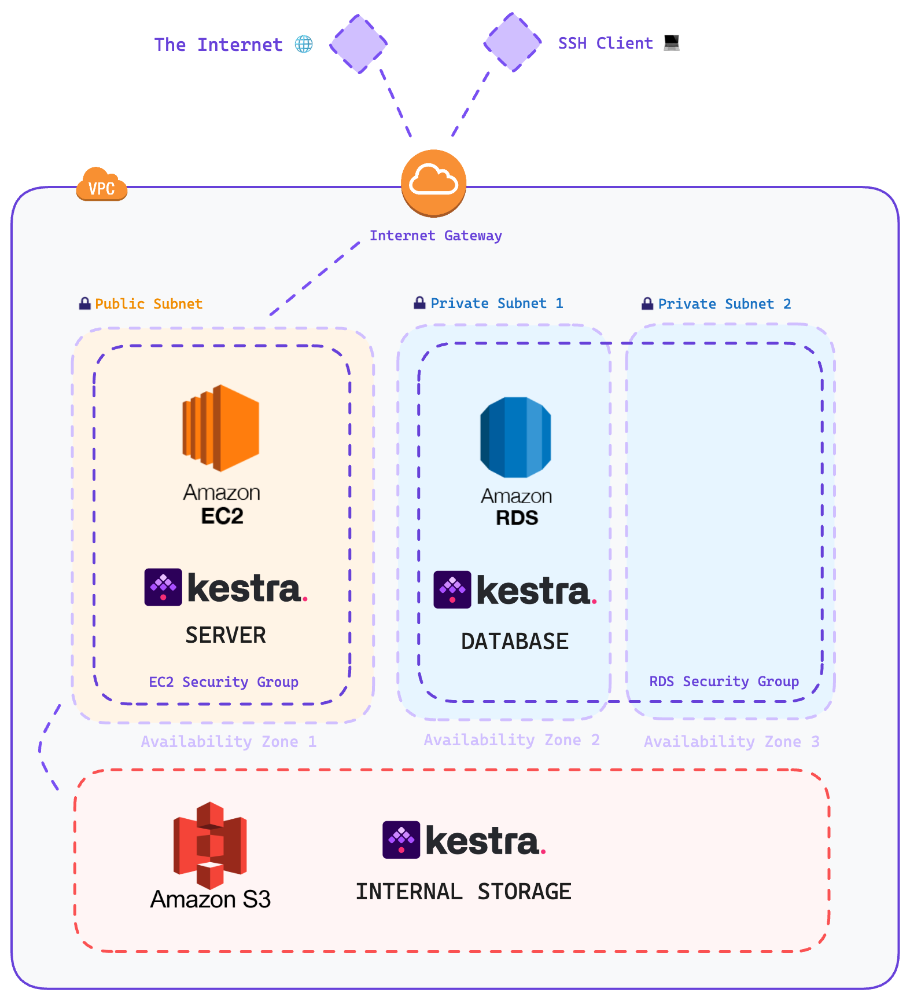

# Cloudformation-deployment-kestra

> [!NOTE]
> This repository is built based on the reference for Terraform deployment of Kestra with minor modifications. The original repository can be found [here](https://github.com/kestra-io/terraform-deployments/tree/main/aws-ec2). Some part of the README is copied from the original repository.

This repository contains CloudFormation files to deploy Kestra on AWS with the following components:
- AWS EC2: to host Kestra server
- RDS Postgres: the Kestra database backend
- AWS S3: the Kestra internal storage
- AWS SecretsManager: to store access and secret keys
- AWS IAM: to manage the permissions

The difference between this repository and the original repository is that 
- this repository uses CloudFormation instead of Terraform for deployment
- IAM user is used instead of personal account
- SecretsManager is used for storing access and secret keys for IAM user



## What has to be modified?

> Note: this configuration assumes that you already have an IAM user with sufficient permissions to create all required resources (EC2, RDS, VPC).

In infrastructure/cloudformation/resources.yaml, modify the following:

`db_username`: this is going to be the master user for RDS

`db_password`: this is going to be the RDS master user's password

`my_ip`: this is going to be your public IP

### Create the Key Pair

To authenticate to your EC2 instance easily and provision the script initiation you need to create a key pair - allowing a SSH tunel connection:

```bash
ssh-keygen -t rsa -b 4096 -m pem -f kestra_kp && openssl rsa -in kestra_kp -outform pem && chmod 400 kestra_kp.pem
mv kestra_kp kestra_kp.pem
```

> Note: depending of your system, the key might be named `kestra_kp` (without the `.pem` extension). You can use `mv kestra_kp kestra_kp.pem` to solve this issue.

After that, you have to add it to EC2/Key Pairs in the AWS Console or via CLI/CloudFormation if you wish. In this example, key pair already existed in the AWS account and there was no need to create a new one.

### Deploy

`bash scripts/deploy.sh dev`

Note that the `dev` is the environment name, you can change it to whatever you want.

### To destroy everything that was created by the CloudFormation

AWS CLI: `aws cloudformation delete-stack --stack-name infra-kestra`

Alternatively, you can remove it via the AWS Console.
